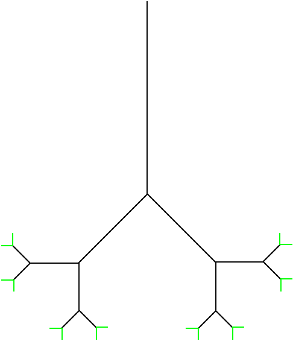

### Compilation techniques - LTurtle
Interpreter of own language allowing to define an L-system and describe elementary operations in that system using 'turtle graphics'.  

#### Sample code
Sample code creating binary tree ([based on L-system description on Wikipedia](https://en.wikipedia.org/wiki/L-system)):   
```
s0 = { pencolour(0, 255, 0); forward(20.0); }; # 0 from Wikipedia, make leaf green
s1 = { pencolour(0, 0, 0); forward(40.0); }; # 1 from Wikipedia, make non-leaf black
left = { pushstate(); rotate(-45.0); }; # [ from Wikipedia
right = { popstate(); rotate(45.0); }; # ] from Wikipedia
s1 -> s1 + s1;
s0 -> s1 + left + s0 + right + s0;
tree4 = evaluate(4, s0); # evaluate 4 times, using productions given above
pensize(2); # change lines width
execute(tree4); # draw using instructions stored in tree4
```
It produces:  

  
#### Dependencies
In order to build this program, you need:  
* cmake (I used version 3.11.1)  
* C++ (at least 11) compiler (I used gcc 7.3.1)  
* BOOST library (unit testing component) (I used version 1.66.0-2)  
* SFML library (I used version 2.5.0-1)  

Everything was tested on an x86-64 computer running Manjaro Linux, but program should be portable.  
  
#### Building  
You can use script recompile\_all.sh (warning - it will override existing 'build' directory), which simply does:  
```
rm -rf build
mkdir build
cd build
cmake .. -DCMAKE_BUILD_TYPE=Release #Debug
make -j$(nproc)
```
Building auxiliary program hashtest is optional - it was needed only to generate hashing function in my lexer.  

#### Running  
Usage: ./lturtle <argument>  
<argument> can be:  
* --lexer : runs only lexer test, giving list of tokens  
* --parser : runs only parser test, output should be the same as input, excluding comments and whitespace  
* (any other - output image filename) : runs interpreter, saving result in a file  
  
Regardless of mode used, program uses standard input - in order to interpret file, redirect it, for example, to run sample code creating binary tree:
``` 
./build/lturtle bintree.png <test_code/binary_tree  
```

